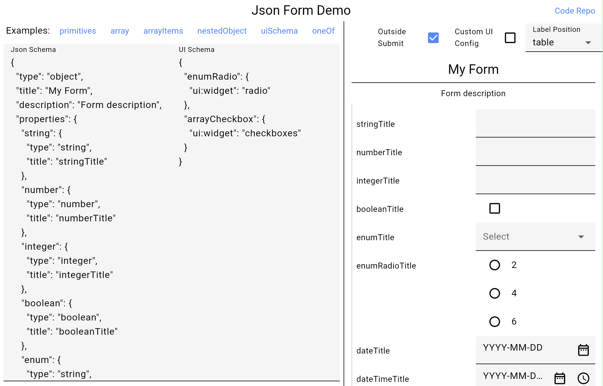
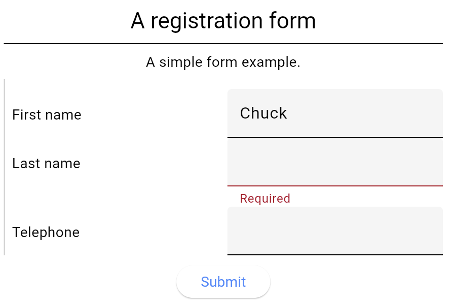
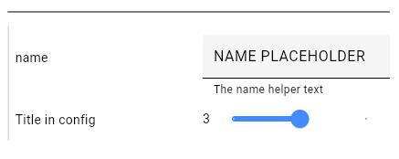

[](https://coveralls.io/github/juancastillo0/json_form?branch=main)
[](https://codecov.io/gh/juancastillo0/json_form)
[](https://github.com/juancastillo0/json_form/actions/workflows/melos-ci.yaml)
[](https://github.com/juancastillo0/json_form/blob/main/LICENSE)
[](#contributing)

<h3 align="center">json_form</h3>

A [Flutter](https://flutter.dev/) widget capable of using [JSON Schema](https://json-schema.org/) to declaratively build and customize input forms.

Inspired by [react-jsonschema-form](https://github.com/rjsf-team/react-jsonschema-form).


## Table of Contents

- [Table of Contents](#table-of-contents)
- [Installation](#installation)
- [Examples](#examples)
- [Usage](#usage)
  - [JsonSchema Types](#jsonschema-types)
    - [String](#string)
    - [Enum, Selects and Checkboxes](#enum-selects-and-checkboxes)
    - [Object](#object)
    - [Arrays \& Files](#arrays--files)
    - [File Picker Handlers](#file-picker-handlers)
    - [Custom Validators](#custom-validators)
    - [Custom Select Picker Handlers](#custom-select-picker-handlers)
    - [Definitions (`$defs`) and References (`$ref`)](#definitions-defs-and-references-ref)
    - [`dependencies` and `oneOf`](#dependencies-and-oneof)
  - [UI Schema](#ui-schema)
    - [Example](#example)
    - [Individual `ui:<propertyName>`](#individual-uipropertyname)
    - [Grouped `ui:options`](#grouped-uioptions)
    - [Nested properties](#nested-properties)
    - [UI Schema Configurations](#ui-schema-configurations)
  - [UI Config](#ui-config)
    - [Custom Widget Builders](#custom-widget-builders)
      - [Form Sections](#form-sections)
      - [Buttons](#buttons)
    - [Localization (l10n) and Internationalization (i18n)](#localization-l10n-and-internationalization-i18n)
  - [TODO](#todo)


## Installation

Add dependency to pubspec.yaml

```
dependencies:
  json_form: ^0.0.1+1
```

See the [File Picker Installation](https://github.com/miguelpruivo/flutter_file_picker) for file fields.


## Examples

You can interact with multiple form examples in the [deployed web page](https://juancastillo0.github.io/json_form/). The code for the page can be found in the [example folder of this repo](./example/lib/main.dart).



## Usage

`JsonForm` is mhe main Widget exposed by the package. You can use it by providing a [Json Schema](https://json-schema.org/) formatted `String` with all the fields and their configurations as shown in this example:

```dart
import 'package:json_form/json_form.dart';

final jsonSchema = '''
{
  "title": "A registration form",
  "description": "A simple form example.",
  "type": "object",
  "required": [
    "firstName",
    "lastName"
  ],
  "properties": {
    "firstName": {
      "type": "string",
      "title": "First name",
      "default": "Chuck"
    },
    "lastName": {
      "type": "string",
      "title": "Last name"
    },
    "telephone": {
      "type": "string",
      "title": "Telephone",
      "minLength": 10
    }
  }
}
''';

@override
Widget build(BuildContext context) {
  return Scaffold(
    body: JsonForm(
      jsonSchema: jsonSchema,
      onFormDataSaved: (data) {
        inspect(data);
      },
    ),
  );
}
```



### JsonSchema Types

Supported types include:

- [string](#string)
- number 
- integer
- boolean
- null
- files (string with data-url format)
- object
- array

#### String

Depending on the ["format" configured for the "string" type in the Json Schema](https://json-schema.org/understanding-json-schema/reference/string#format)
the widget or settings for the text field will be configured. The following are the supported formats:

  - "email" and "uri" set the format within the text field
  - "date-time" and "date" will present a text field with buttons for configuring the date and time using MaterialUI's dialogs.
  - "time" validate the input using the RegExp `^[0-9]{2}:[0-9]{2}(:[0-9]{2})?$`
  - "data-url" for [file pickers](#arrays--files)

#### Enum, Selects and Checkboxes

Enumerations can be used for any of the primitive types (string, number, integer, boolean) by setting the "enum" property within the Json Schema object with the list of variants or options. A select or single-value dropdown will be presented.

For presenting a multi-select or checkbox you may use an array and configuring the "enum" property within the "items" object of the array. You may use the `uniqueItems` JsonSchema property for the array and the `ui:widget` [UISchema property](#ui-schema) equal to `checkboxes` for further customization.

#### Object

#### Arrays & Files

Within the [Json Schema](https://json-schema.org/) specification, you may specify a `List` with the Json type "array" within the configuration.
Files can be configured using the Json type "string" with a format "data-url".

```dart
final jsonSchema = '''
{
  "title": "Example 2",
  "type": "object",
  "properties": {
   "listOfStrings": {
      "type": "array",
      "title": "A list of strings",
      "items": {
        "type": "string",
        "title" : "Write your item",
        "default": "bazinga"
      }
    },
    "files": {
      "type": "array",
      "title": "Multiple files",
      "items": {
        "type": "string",
        "format": "data-url"
      }
    }
  }
}
''';
```

#### File Picker Handlers

If you use a field of Json type "string" and format "data-url" for file inputs fields, you have to provide a way of selecting files when a user taps in the "Add" file button:

```dart
import 'package:cross_file/cross_file.dart';

fieldFilePicker: (JsonFormField<Object?> field) {
  if (field.key == 'fieldName') {
    // return a specific file handler for the "fieldName" input
  }
  // return the default file handler
  return () async {
    return [
      XFile(
        'https://cdn.mos.cms.futurecdn.net/LEkEkAKZQjXZkzadbHHsVj-970-80.jpg',
      ),
    ];
  };
}
```

The returned values will be used as the output value when submitting or saving the form.

#### Custom Validators

You may provide a custom validator for each field:

```dart
fieldValidator: (JsonFormField<Object?> field) {
  if (field.key == 'fieldName') {
    return (value) {
      if (value == '2') return 'The value cannot be 2'
      return null;
    };
  }
  return null;
}
```


#### Custom Select Picker Handlers

#### Definitions (`$defs`) and References (`$ref`)

#### `dependencies` and `oneOf`

// TODO: fieldSelectPicker docs


### UI Schema

Another parameter of the `JsonForm` widget is the `uiSchema` Json `String`. By providing an `uiSchema` you may configure different UI parameters 
such as helper texts and the "widget" or presentations used for the specific field.

#### Example

The code example results in the following image:



```dart
final jsonSchema = '''
{
  "type": "object",
  "properties": {
   "name": {
      "type": "string"
    },
    "int": {
      "type": "integer",
      "minimum": 2,
      "maximum": 5,
      "ui:options": {
        "title": "Title in config"
      }
    }
  }
}
''';

final uiSchema = '''
{
  "name": {
    "ui:help": "The name helper text",
    "ui:options": {
      "placeholder": "NAME PLACEHOLDER"
    }
  },
  "int": {
    "ui:widget": "range"
  }
}
''';

Widget build(BuildContext context) {
  return JsonForm(
    jsonSchema: jsonSchema,
    uiSchema: uiSchema,
  );
}
```

In the example you may find the following ways of configuring properties.

#### Individual `ui:<propertyName>`

Can be used within the uiSchema. 
In the example:
- `"ui:help": "The name helper text",`
- `"ui:widget": "range"`

#### Grouped `ui:options`

Can be used within the jsonSchema o in the uiSchema. In both, you don't need to provide the `ui:` prefix.

In the example within the `uiSchema`:

```json
"ui:options": {
  "placeholder": "NAME PLACEHOLDER"
}
```

In the example within the `jsonSchema`:

```json
"ui:options": {
  "title": "Title in config"
}
```

#### Nested properties

You can specify the properties within the json schema object for the property that you want to modify or as a nested
property within the uiSchema.


#### UI Schema Configurations

This table has all the configurations implemented within a UI Schema. These properties can be configured using 
`ui:<propertyName>` and `ui:options` as explained in the previous sections.

| Configuration   | Type            | Default | Only For   | Description                                                                                                                                                         |
| --------------- | --------------- | ------- | ---------- | ------------------------------------------------------------------------------------------------------------------------------------------------------------------- |
| title           | String?         |         |            | The user facing title of the field                                                                                                                                  |
| description     | String?         |         |            | The user facing description of the field                                                                                                                            |
| globalOptions   | UiSchemaData?   |         |            | Applies the options to all children                                                                                                                                 |
| help            | String?         |         |            | Helper text for the user                                                                                                                                            |
| readOnly        | bool            | false   |            | Can't be updated, but will be sent                                                                                                                                  |
| disabled        | bool            | false   |            | Can't be updated and will not be sent                                                                                                                               |
| hidden          | bool            | false   |            | Does not show or sends the value                                                                                                                                    |
| hideError       | bool            | false   |            |                                                                                                                                                                     |
| placeholder     | String?         |         | text       | The input's hint text                                                                                                                                               |
| emptyValue      | String?         |         | text       | Sent when the value is empty                                                                                                                                        |
| autoFocus       | bool            | false   |            | Focuses the input on rendering                                                                                                                                      |
| autoComplete    | bool            | false   | text       | Enabled auto complete suggestions                                                                                                                                   |
| yearsRange      | List\<int\>?    |         | date       |
| format          | String          | 'YMD'   | date       |                                                                                                                                                                     |
| hideNowButton   | bool            | false   | date       |                                                                                                                                                                     |
| hideClearButton | bool            | false   | date       |                                                                                                                                                                     |
| widget          | String?         |         |            | The kind of input to be used. boolean: radio, select, checkbox (default). string: textarea, password, color, file. number: updown, range, radio. array: checkboxes. |
| accept          | String?         |         | file       | The mime types accepted in the file input                                                                                                                           |
| enumNames       | List\<String\>? |         | enum       | The named or labels shown to the user for each of the enum variants                                                                                                 |
| enumDisabled    | List\<String\>? |         | enum       | List of enum values that are disabled                                                                                                                               |
| width           | double          |         |            | The width in pixels of the input. If it's a global configuration it will be used as the width for the table input column                                            |
| order           | List\<String\>? |         | object     | The order of the properties of an object                                                                                                                            |
| inline          | bool            | false   | checkboxes | Whether the checkboxes are positioned in a horizontal line                                                                                                          |
| addable         | bool            | true    | array      | Whether the user can add items to an array                                                                                                                          |
| removable       | bool            | true    | array      | Whether the user can remove items from an array                                                                                                                     |
| orderable       | bool            | true    | array      | Whether the user can reorder or move the items in an array                                                                                                          |
| copyable        | bool            | true    | array      | Whether the user can copy or duplicate the items in an array                                                                                                        |


### UI Config

Global configuration for the UI of the form. Contains styles, texts, widget builders and other Flutter configurations such as `labelPosition` and `autovalidateMode`.

```dart
Widget build(BuildContext context) {
  final uiConfig = JsonFormUiConfig(
    subtitle: Theme.of(context).textTheme.titleMedium,
    labelPosition: LabelPosition.input,
    autovalidateMode: AutovalidateMode.onUnfocus,
  );
    
  return JsonForm(
    jsonSchema: jsonSchema,
    uiConfig: uiConfig,
  );
}
```

| Configuration              | Type                                                          | Default                                                           | Description                                                                                                                                               |
| -------------------------- | ------------------------------------------------------------- | ----------------------------------------------------------------- | --------------------------------------------------------------------------------------------------------------------------------------------------------- |
| title                      | TextStyle?                                                    | titleLarge                                                        |                                                                                                                                                           |
| titleAlign                 | TextAlign?                                                    | center                                                            |                                                                                                                                                           |
| subtitle                   | TextStyle?                                                    | titleMedium (bold)                                                |                                                                                                                                                           |
| description                | TextStyle?                                                    | bodyMedium                                                        |                                                                                                                                                           |
| fieldLabel                 | TextStyle?                                                    |                                                                   |                                                                                                                                                           |
| fieldInput                 | TextStyle?                                                    |                                                                   |                                                                                                                                                           |
| fieldInputReadOnly         | TextStyle?                                                    | TextStyle(color: Colors.grey)                                     |                                                                                                                                                           |
| error                      | TextStyle?                                                    | bodySmall (colorScheme.error)                                     | Text style for validation errors                                                                                                                          |
| localizedTexts             | LocalizedTexts                                                | [English](./lib/src/utils/localized_texts.dart)                   | Translations of the standardized texts used within the form. For example, they are used for validation errors and buttons (add, remove, show, hide, ...)  |
| debugMode                  | bool                                                          | false                                                             | Shows an "inspect" button for debugging                                                                                                                   |
| labelPosition              | LabelPosition                                                 | table                                                             | The location of the input field labels. Options: side, top, table, input (InputDecoration)                                                                |
| autovalidateMode           | AutovalidateMode                                              | onUserInteraction                                                 | The `Form`'s validation execution                                                                                                                         |
| addItemBuilder             | Widget? Function(VoidCallback onPressed, String key)?         |                                                                   | Add Item button for arrays                                                                                                                                |
| removeItemBuilder          | Widget? Function(VoidCallback onPressed, String key)?         |                                                                   | Remove Item button for arrays                                                                                                                             |
| copyItemBuilder            | Widget? Function(VoidCallback onPressed, String key)?         |                                                                   | Duplicate or Copy Item button for arrays                                                                                                                  |
| submitButtonBuilder        | Widget? Function(VoidCallback onSubmit)?                      | Centered button inside the main scroll                            | The main Submit form button                                                                                                                               |
| addFileButtonBuilder       | Widget? Function(VoidCallback? onPressed, String key)?        |                                                                   |                                                                                                                                                           |
| formBuilder                | Form? Function(GlobalKey\<FormState\> formKey, Widget child)? | 12 of padding over the form                                       | Builds the Form widget you can use it to wrap the whole form                                                                                              |
| formSectionBuilder         | Widget? Function(Widget child)?                               | Left border over a section                                        | Wraps a form section. Objects and arrays create form sections                                                                                             |
| titleAndDescriptionBuilder | Widget? Function(SchemaUiInfo info)?                          | Adds a divider for form sections and top padding for table titles | Returns the title and description widget for a schema. Used within a form section for objects and arrays, and for fields when using `LabelPosition.table` |
| fieldWrapperBuilder        | Widget? Function(FieldWrapperParams params)?                  | Side and top field labels                                         | Wraps the input field and returns it with the label                                                                                                       |
| inputWrapperBuilder        | Widget? Function(FieldWrapperParams params)?                  |                                                                   | Wraps the input field and returns it without the label                                                                                                    |


#### Custom Widget Builders

They allow you to customize the visualization of certain sections and buttons of your form.

##### Form Sections

The `formBuilder` can be used to Instantiate Flutter's `Form` widget with you own parameters:

```dart
formBuilder: (GlobalKey<FormState> formKey, Widget child) {
  return Form(
    key: _formKey,
    canPop: false,
    onChanged: () {
      print('Form changed');
    },
    child: Padding(
      padding: const EdgeInsets.all(12.0),
      child: Column(
        children: [
          Text('Form Title'),
          Expanded(child: child),
        ],  
      ),
    ),
  );
}
```

Other builders that allow you to change the rendering of distinct form and field sections include:
 `formSectionBuilder`, `titleAndDescriptionBuilder`, `fieldWrapperBuilder` and `inputWrapperBuilder`.

##### Buttons

- Arrays: You can change the buttons that add, remove and copy array items.
- Form: The `submitButtonBuilder` allows you to render a custom "Submit" button for the whole `JsonForm`.
- Files: The addFileButtonBuilder. // TODO: other file buttons

#### Localization (l10n) and Internationalization (i18n)

You can create a new instance that implements the `LocalizedTexts` class. By default, it contains English translations
for the text presented within the form such as validation error messages and button labels or tooltips.

```dart
class SpanishLocalizedTexts extends LocalizedTexts {
  const SpanishLocalizedTexts();

  /// Used to display the error message when a required field is empty
  @override
  String required() => 'Requerido';

  /// Used when a [String] is too short.
  @override
  String minLength({required int minLength}) =>
      'Debería tener al menos $minLength caracteres';

  /// ... override other methods
}

final uiConfig = JsonFormUiConfig(
  localizedTexts: Localizations.localeOf(context).languageCode == 'es'
      ? const SpanishLocalizedTexts()
      : null,
);
```

### TODO

- [ ] pub.dev

